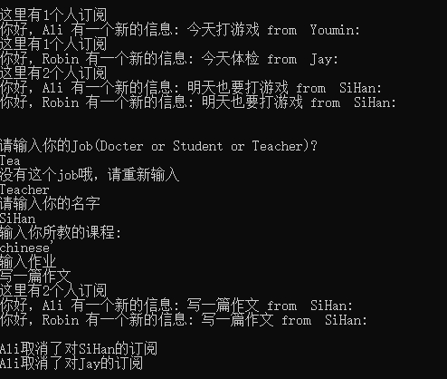
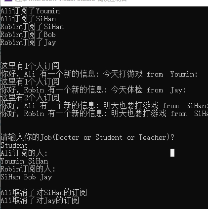

### 观察者模式

有一个订阅方的基类，一个发布方的基类。学生类继承订阅方，老师类和医生类继承发布方。这样老师和医生可以发布信息。学生可以查看自己订阅的老师或医生所发布的信息。这样写有一个好处就是便于拓展，如果有一个新的发布方（例如家长）直接从发布方的类中继承即可。然后子类可以拓展一些信息，例如老师的课程，学生的年龄等，在对应的类中添加对应的属性以及方法即可。但在交互的代码中拓展性不是很强，在交互的部分应该会有更好的面向对象的写法（暂时还不会呀）这是一个可以提高的地方。

程序的运行结果如下：

